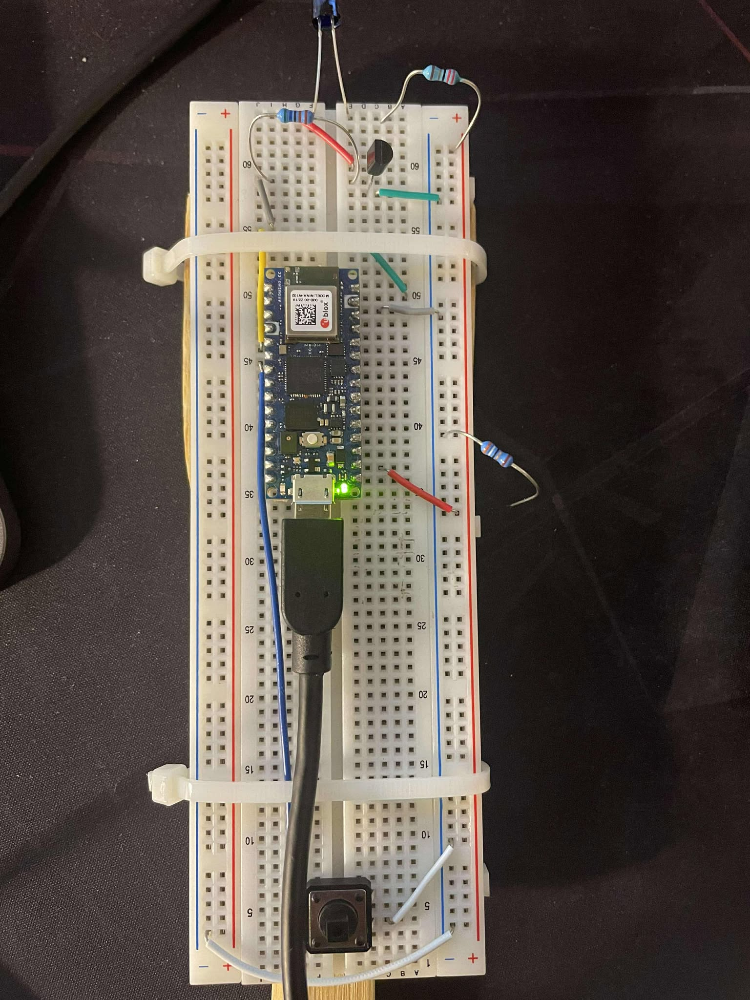
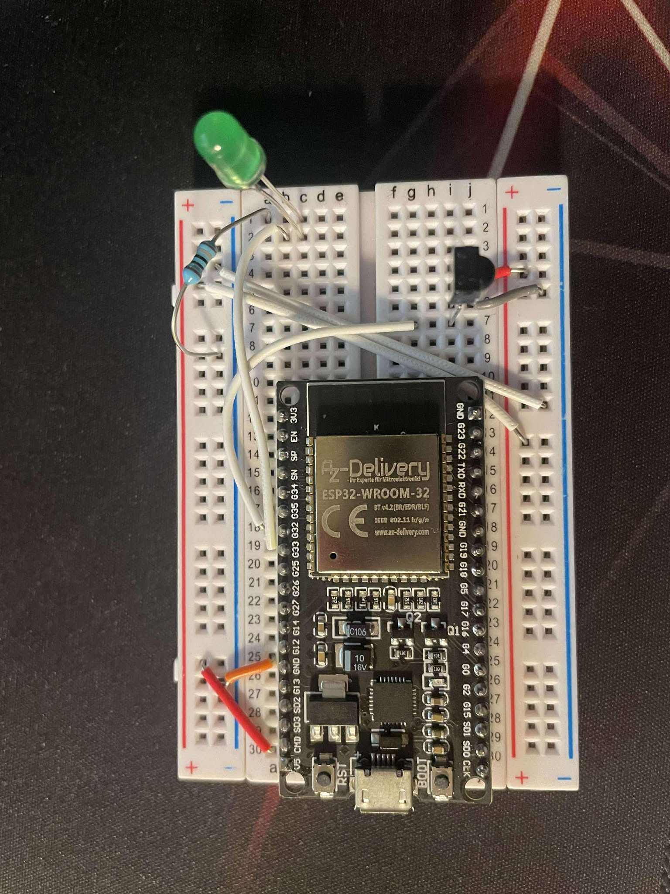

# Magic-Wand-Smart-Lighting-System

- Hardware requirements:
    - Arduino Nano RP2040 Connect
    - ESP32 NodeMCU Module WLAN WiFi Dev Kit
    - 2x Breadboard
    - 1x IR LED
    - 3x IR TSOP Receivers
    - 220 or 180 ohm resistors
    - NPN Transistor (on/off switch)
    - 22 ohm resistors
    - 5600 ohm resistors
    - 1x Tactile Switch (Button)
    - Jumper Wires 
    - 24-22 AWG Wires
    - RGB Led Strip (1m with 60 RGB leds shold be enough)
    - Led lights, for signals and communication.

- Additional hardware requirements:
    - Perfboard.
    - RGB Led strip power suply.

# SETUP

